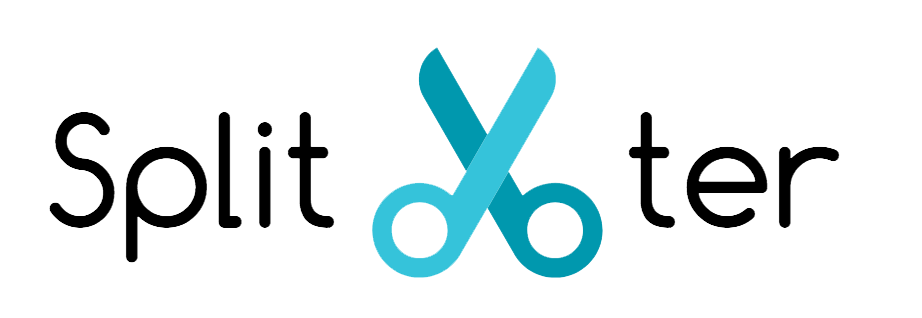

A bill splitting and payment requesting application.

## Team

- [Joseph Kwon](https://github.com/JKwon823)
- [Carlos Osorio](https://github.com/cosorio94)
- [Minji Lee](https://github.com/minjilee8816)
- [Kai Mashima](https://github.com/kai-mashima)

## Roadmap

View the project plan [here](https://docs.google.com/document/d/13KKGWZLLw55PLkTyyidUwnM2V4Dp7jF7q7JhMmanzcY/edit?usp=sharing)

View the project presentation slides [here](http://imgur.com/a/b2pWy)

## Contributing

See [CONTRIBUTING.md](CONTRIBUTING.md) for contribution guidelines.

# Table of Contents

1. [Usage](#Usage)
1. [Requirements](#requirements)
1. [Development](#development)
    1. [Installing Dependencies](#installing-dependencies)
    1. [Tasks](#tasks)

## Usage

> Some usage instructions

## Requirements

- Node 6.9.x
- Redis 3.2.x
- Postgresql 9.6.x
- Axios 0.16.2
- Bluebird 3.5.0
- Bookshelf 0.10.3
- Express 4.15.2
- Jquery 3.2.1
- Knex 0.12.9
- React 15.4.2
- Redux 3.7.2
- Twilio 3.5.0
- Webpack 3.3.0
- React-sortablejs 1.3.4
- React-bootstrap 0.31.1
- React-router-dom 4.1.1
- React-side-bar 0.3.5
- Redux-devtools-extension 2.13.2
- Redux-promise-middleware 4.3.0

## Development

### Installing System Dependencies

```
brew install yarn
brew install redis
brew install postgresql
```

Yarn is a replacement for npm. It's faster and *guarantees* consistency -- as you deploy your code in various environments, you won't run the risk of slight variations in what gets installed.

### Install Project Dependencies

```
yarn global add grunt-cli knex eslint
```

## App Configuration

Override settings `config/default.json` in any environment by making a copy of `config/ENV.example.json` and naming it `config/ENV.json` and setting the appropriate variable. 

For environments that require use of environment variables, you can supply variables as defined in `config/custom-environment-variables.json`.

See https://www.npmjs.com/package/config
And https://github.com/lorenwest/node-config/wiki/Environment-Variables#custom-environment-variables

## Database Initialization

IMPORTANT: ensure `postgres` is running before performing these steps.

### Database Creation:

Use grunt to create a new database for your development and test environments:

Development envronment: `grunt pgcreatedb:default`

Other environments, specify like so: `NODE_ENV=test grunt pgcreatedb:default`

### Run Migrations & Data Seeds

In terminal, from the root directory:

To migrate to the latest version, run:

`knex migrate:latest --env NODE_ENV`

To rollback a version, run:

`knex migrate:rollback --env NODE_ENV`

To populate the database with seed data, run:

`knex seed:run --env NODE_ENV`

Note: `--env NODE_ENV` may be omitted for development. For example, `knex migrate:latest` will run all migrations in the development environment, while `knex migrate:latest --env test` will migrate in the test environment.

## Running the App

To run webpack build: `yarn run build`

To run server: `yarn run start`

To run tests: `yarn run test`

To run your redis server for the session store `redis-server`
